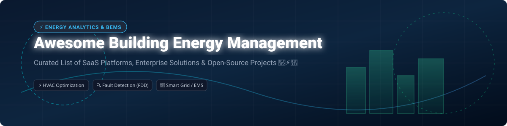

# Awesome Building Energy Management 🏢⚡🌱

  

  
  
  
  
  

## 🚀 Overview & Ecosystem Summary

Welcome to the **Awesome Building Energy Management Systems (BEMS)** directory — a curated list of top SaaS platforms, commercial software, and open-source projects for **Building Energy Management**, **HVAC Optimization**, **Automated Fault Detection & Diagnostics (AFDD)**, and **Decarbonization Analytics**.

Whether you are a facility manager, building engineer, IoT developer, or sustainability researcher, this repository helps you discover production-ready solutions and open-source frameworks to monitor energy consumption, optimize HVAC operations, reduce greenhouse gas emissions, and achieve smart grid interactivity.

---

## 📑 Table of Contents
- [🏢 SaaS & Commercial Platforms](#-saas--commercial-platforms)
- [🔓 Open-Source GitHub Projects](#-open-source-github-projects)
- [🤝 How to Contribute](#-how-to-contribute)
- [💖 Support & Sponsorship](#-support--sponsorship)
- [⚠️ Disclaimer](#%EF%B8%8F-disclaimer)
- [📈 Star History](#-star-history)

---

## 🏢 SaaS & Commercial Platforms

> 💡 **Market Size & Structure**: The global Building Energy Management Systems (BEMS) market is valued at approximately **$12.5 Billion to $15.0 Billion** (2025/2026) and is projected to reach over **$28 Billion by 2032** growing at a CAGR of ~11.5%. The market is **moderately fragmented**, featuring a mix of enterprise industrial conglomerates (C3 AI, Trane/BrainBox AI), mid-tier IoT platforms (GridPoint, Facilio), and niche HVAC/FDD specialists.

Below is a structured comparison of leading commercial BEMS and building analytics software sorted by **Company Size / Revenue / Valuation (Descending)**:

| Platform | Company Size / Valuation / Revenue | Starting Price | Free Tier / Trial Limit | Key Focus & Features |
| :--- | :--- | :--- | :--- | :--- |
| **[C3 AI Energy Management](https://c3.ai/)** 🤖 | **$3.5B Valuation** / ~$310M Annual Revenue | $250,000 / year (Enterprise deployment) | 14-Day Enterprise Sandbox Demo | Enterprise AI for portfolio-wide energy optimization, carbon tracking, and predictive maintenance. |
| **[BrainBox AI](https://www.brainboxai.com/)** 🧠 | **$103M+ Raised** (Acquired by Trane Technologies $50B+ Market Cap) | $0.05 / sq ft / year (SaaS subscription model) | Free Energy Audit & Savings Assessment Report | Autonomous deep learning AI for real-time HVAC optimization and carbon reduction. |
| **[GridPoint](https://www.gridpoint.com/)** ⚡ | **$150M+ Valuation** / ~$75M Annual Revenue | $300 / month / site (Hardware + SaaS bundle) | Free Site Assessment & 30-Day Pilot | Commercial energy management, demand response, microgrid integration, and submetering. |
| **[Facilio](https://facilio.com/)** 🏢 | **$100M+ Valuation** / ~$30M Annual Revenue | $500 / month (Basic commercial facility tier) | 14-Day Free Trial (Full Platform Features) | Connected building operations, IoT-driven asset maintenance, and portfolio energy analytics. |
| **[Switch Automation](https://www.switchautomation.com/)** 🌐 | **$50M+ Valuation** / ~$15M Annual Revenue | $400 / month / facility | 30-Day Free Trial with Sample Building Datasets | Smart building platform for ESG reporting, system integration, and environmental monitoring. |
| **[Clockworks Analytics](https://www.clockworksanalytics.com/)** 🔍 | **$45M Valuation** / ~$12M Annual Revenue | $0.03 / sq ft / year | 30-Day Pilot Trial for Qualified Commercial Portfolios | Automated Fault Detection and Diagnostics (AFDD) for HVAC equipment and air handlers. |
| **[75F](https://www.75f.io/)** 🌡️ | **$40M+ Valuation** / ~$10M Annual Revenue | $250 / controller unit + $15/mo SaaS fee | 30-Day Money-Back Guarantee & Hardware Demo | IoT-based smart building automation system targeting commercial HVAC and zone control. |
| **[Verdigris](https://verdigris.co/)** 📊 | **$35M Valuation** / ~$8M Annual Revenue | $150 / month / panel (AI hardware + software bundle) | 30-Day Risk-Free Hardware Trial | High-frequency AI circuit-level submetering and predictive equipment failure alerts. |
| **[Enertiv](https://www.enertiv.com/)** 📉 | **$30M Valuation** / ~$6M Annual Revenue | $200 / month / building | 14-Day Guided Platform Demo | Building operations platform focused on submetering, energy tracking, and tenant billing. |
| **[BuildingIQ](https://www.buildingiq.com/)** 🏛️ | **$15M Valuation** / ~$5M Annual Revenue | $0.04 / sq ft / year | Free 30-Day Thermal Profile Analysis | Predictive HVAC optimization using thermodynamic modeling and cloud control. |

---

## 🔓 Open-Source GitHub Projects

The open-source ecosystem offers production-grade Energy Management Systems (EMS), fault detection pipelines, control testbeds, and simulation tools.

The repos below are sorted by **GitHub Stars_Count (Descending)**:

-  **[MyEMS](https://github.com/MyEMS/myems)** 🇨🇳  
  Industry-leading open-source Energy Management System aligned with ISO 50001 (GB/T 23331-2020). Collects and analyzes electricity, water, gas, cooling, and heating data. Includes enterprise features for photovoltaics, energy storage, charging piles, microgrids, and AI optimization. Python/React stack with MySQL database.

-  **[VOLTTRON](https://github.com/VOLTTRON/volttron)** ⚡  
  The leading open-source distributed control and sensing platform for buildings, developed at Pacific Northwest National Laboratory (PNNL) under the Eclipse Foundation. Python-based agent architecture with pub-sub message bus, BACnet/Modbus drivers, automated fault detection, and demand response.

-  **[City Energy Analyst (CEA)](https://github.com/architecture-building-systems/CityEnergyAnalyst)** 🏙️  
  Open-source urban building energy modeling (UBEM) platform for designing low-carbon cities. Combines urban planning and energy systems engineering to evaluate energy infrastructure scenarios and decarbonization trade-offs.

-  **[BOPTEST](https://github.com/ibpsa/boptest)** 🧪  
  Building Optimization Performance Tests framework by IBPSA for benchmarking advanced HVAC control strategies using containerized Modelica emulators and standardized KPIs.

-  **[BEMServer](https://github.com/BEMServer/bemserver)** 🇪🇺  
  Open-source platform designed to centralize heterogeneous building data (BMS, sensors, weather, occupancy). Features a semantic data model, REST APIs for analytics, forecasting, and energy performance indicators. Developed under the EU HIT2GAP project.

-  **[Open-FDD](https://github.com/bbartling/open-fdd)** 🔧  
  Cloud-native building analytics and fault detection pipeline built on Apache Arrow, DataFusion SQL, Rust, React, Mosquitto MQTT, and BACnet/Modbus edge agents. Includes Pandas-based FDD rule libraries.

-  **[BEMOSS](https://github.com/bemoss/bemoss_os)** 🔌  
  Building Energy Management Open-Source Software for monitoring and controlling HVAC, lighting, plug loads, solar PV, and energy storage with OpenADR demand response support.

-  **[ZandrEA](https://github.com/usnistgov/ZandrEA)** 🏛️  
  NIST framework for real-time automated fault detection and diagnostics (AFDD) in commercial HVAC systems, combining rule-based and process history-based methods. Dockerized architecture with C++ engine, Python scripts, and React GUI.

-  **[ACTIVE Framework](https://github.com/SmithRWORNL/ACTIVE)** 🔬  
  Automated Control Testbed for Integration, Verification, and Emulation from Oak Ridge National Laboratory (ORNL). Supports AI, rule-based, and model-based building control strategies from simulation to field deployment.

-  **[CEAM](https://github.com/Climate2Preserv/CEAM)** 🏛️  
  Data-driven multicriteria analysis tool for heritage building climate management and energy optimization. Uses AI optimization to achieve 10-50% energy savings while preserving historical structures.

-  **[openbms-io/bms-apps](https://github.com/openbms-io/bms-apps)** 📱  
  Modern open-source BMS application suite in a pnpm monorepo featuring Zod schema validation, SQLite/Turso database support, and IoT control interfaces.

---

## 🤝 How to Contribute

Contributions are highly appreciated! To contribute:

1. **Fork** this repository.
2. Create a new branch (`git checkout -b feature/add-new-project`).
3. Add your entry to `README.md` following the table/markdown structure.
4. Ensure descriptions are concise, factual, and include relevant links.
5. **Open a Pull Request** with a brief summary of the addition.

Please check out [Awesome-Awesome-Awesome](https://github.com/ishandutta2007/Awesome-Awesome-Awesome) for more curated lists!

---

## 💖 Support & Sponsorship

If you found this repository helpful for your building energy research, commercial project, or open-source development, please consider showing your support:

- ⭐ **Star** this repository to increase its visibility.
- 🔀 **Fork** and contribute new tools or updates.
- 📢 **Share** this list with colleagues, engineers, and facility managers.
- ☕ **Buy me a coffee / Sponsor**: If you'd like to support ongoing maintenance and curation, check out the [GitHub Sponsor Dashboard](https://github.com/sponsors/ishandutta2007).

Thank you for helping make building energy management more open, smart, and sustainable! 🌿

---

## ⚠️ Disclaimer

- This is a community-curated list intended for informational and educational purposes only.
- Software and SaaS product details (pricing, valuation, free tier limits) are estimated based on publicly available data and industry benchmarks as of 2026.
- Self-hosted open-source software requires proper domain expertise in building protocols (BACnet, Modbus, MQTT, Haystack) and system administration.

---

## 📈 Star History

